</picture>
  <p align="center">
  
</p>
### Terminal-native AI coding agent. Structured methodology. Any LLM.

<p>
  <a href="https://www.npmjs.com/package/arqzero"></a>
  <a href="https://github.com/LuciferDono/ArqZero/blob/master/LICENSE"></a>
  <a href="https://nodejs.org"></a>
  <a href="https://github.com/LuciferDono/ArqZero/stargazers"></a>
  <a href="https://github.com/LuciferDono/ArqZero/issues"></a>
</p>

> **Your code stays local. Your keys stay yours. ArqZero just makes you faster.**

<a href="https://luciferdono.github.io/ArqZero/">
  
</a>

---

## Install

```bash
npm i -g arqzero
```

<details>
<summary><strong>Other methods</strong></summary>

```bash
# npx (no install)
npx arqzero

# From source
git clone https://github.com/LuciferDono/ArqZero.git
cd ArqZero && npm install && npm run dev
```

</details>

```bash
arqzero setup     # Configure your LLM API key
arqzero           # Start coding
```

---

## Features

<table>
<tr>
<td width="60" align="center">
  
</td>
<td>

**42 Structured Capabilities**<br>
TDD, debugging, code review, planning, migration, incident response, security audit — each with 8-10 step imperative protocols. Not "chat about code." Real engineering methodology.

</td>
</tr>
<tr>
<td align="center">
  
</td>
<td>

**Verification Gates**<br>
Won't claim done until tests pass. Mandatory build check, lint, type check, test run, and security scan before every completion. Evidence before assertions.

</td>
</tr>
<tr>
<td align="center">
  
</td>
<td>

**Bring Your Own Key**<br>
Fireworks, OpenAI, Together, Groq, Ollama — any OpenAI-compatible endpoint. Your keys, your models, your data. ArqZero never phones home with your code.

</td>
</tr>
<tr>
<td align="center">
  
</td>
<td>

**18 Built-in Tools**<br>
Read, Write, Edit, MultiEdit, Bash, Glob, Grep, LS, WebSearch, WebFetch, Dispatch, Prompt, Todo, NotebookRead, NotebookEdit, BashOutput, KillShell.

</td>
</tr>
<tr>
<td align="center">
  
</td>
<td>

**Parallel Subagents**<br>
Dispatch up to 7 agents working simultaneously on independent sub-tasks. Auto model routing sends complex work to stronger models.

</td>
</tr>
<tr>
<td align="center">
  
</td>
<td>

**Cross-Session Memory**<br>
Remembers your project, your patterns, your preferences across sessions. Learns from every interaction. Picks up exactly where you left off.

</td>
</tr>
<tr>
<td align="center">
  
</td>
<td>

**Plugin System**<br>
Extend with custom tools, commands, hooks, and capabilities. JSON manifest, auto-discovery, full event system with 11 hook types.

</td>
</tr>
<tr>
<td align="center">
  
</td>
<td>

**Terminal-Native TUI**<br>
Full markdown rendering, syntax highlighting, shimmer spinner, responsive layout (adapts 80col → mobile), diff display with inline edits. Built with Ink.

</td>
</tr>
</table>

---

## How It Works

```
◆ arq › fix the auth bug and add tests for the login flow

  Engaging debugging + security + tdd

  ● Read src/auth/login.ts (67 lines)                     0.2s
  ● Grep "verifyToken" → 4 matches                        0.1s
  ● Edit src/auth/login.ts
    ⎿ + const token = await verifyJWT(req.cookies.session);
    ⎿ - const token = req.headers.authorization;
  ● Write src/auth/login.test.ts (new, 48 lines)
  ● Bash npm test                                          2.1s
    ⎿   67 passing, 0 failing
  ● Verification gate passed — tests green, no regressions

Fixed JWT validation in login — was using raw header instead of
signed cookie. Added 6 tests covering happy path, expired token,
and missing session. All 67 tests green.
```

ArqZero doesn't just edit files. It **reads** the codebase, **identifies** the root cause, **fixes** the code, **writes** tests, **runs** them, and **verifies** everything passes — all in one turn.

---

## Providers

Any OpenAI-compatible endpoint works out of the box:

| Provider | Base URL | Notes |
|----------|----------|-------|
| **Fireworks AI** | `https://api.fireworks.ai/inference/v1` | Default. GLM-4.7 (Enso) + GLM-5 (PRIMUS) |
| OpenAI | `https://api.openai.com/v1` | GPT-4o, o1, etc. |
| Together AI | `https://api.together.xyz/v1` | Llama, Mistral, etc. |
| Groq | `https://api.groq.com/openai/v1` | Ultra-fast inference |
| Ollama | `http://localhost:11434/v1` | Fully local, fully private |
| Any compatible | Any URL | If it speaks OpenAI, it works |

---

## Tools

<details>
<summary><strong>18 tools</strong> — click to expand</summary>

| Tool | What it does |
|------|-------------|
| `Read` | Read files with line numbers |
| `Write` | Create or overwrite files |
| `Edit` | Surgical string replacement |
| `MultiEdit` | Batch edits across multiple files |
| `Bash` | Execute shell commands |
| `BashOutput` | Read output from background processes |
| `KillShell` | Stop running processes |
| `Glob` | Fast file pattern matching |
| `Grep` | Regex content search |
| `LS` | Directory listing |
| `WebSearch` | Search the web |
| `WebFetch` | Fetch URL content |
| `Prompt` | Ask the user a question |
| `Dispatch` | Launch parallel subagents (up to 7) |
| `TodoWrite` | Track task progress |
| `TodoRead` | Read current task list |
| `NotebookRead` | Read Jupyter notebooks |
| `NotebookEdit` | Edit notebook cells |

</details>

## Commands

25 slash commands. Type `/` to browse, or `/help` for details.

<details>
<summary><strong>Full command list</strong></summary>

| Command | What it does |
|---------|-------------|
| `/help` | Show help and available commands |
| `/model` | Switch LLM model |
| `/clear` | Clear conversation history |
| `/compress` | Compact context to save tokens |
| `/config` | View/edit configuration |
| `/quit` | Exit ArqZero |
| `/skill` | Manage and invoke skills |
| `/memory` | View cross-session memory |
| `/undo` | Restore files from checkpoint |
| `/context` | Switch context mode (dev/research/review) |
| `/cost` | Show token usage and cost |
| `/think` | Deep reasoning mode |
| `/permissions` | Manage tool permissions |
| `/tools` | List available tools |
| `/status` | Show session status |
| `/export` | Export conversation |
| `/check` | Run verification checks |
| `/setup` | First-run configuration |
| `/agents` | Show running subagents |
| `/loop` | Autonomous loop mode |
| `/vim` | Vim keybindings |
| `/reload-plugins` | Reload plugins |
| `/plugin` | Plugin management |

</details>

## Capabilities

ArqZero matches your task against 42 structured capabilities — each one a multi-step engineering protocol, not a vague prompt.

<details>
<summary><strong>All 42 capabilities</strong></summary>

**Methodology:** TDD, debugging, code review, refactoring, planning, incident response, migration, performance optimization

**Architecture:** backend patterns, frontend patterns, API design, database design, microservices, event-driven, serverless

**Domain:** authentication, payments, search, real-time, file processing, email, notifications

**Guardrail:** security review, accessibility, i18n, error handling, logging, monitoring

**Orchestration:** subagent dispatch, parallel execution, model routing, context management

**Tool:** custom tool creation, tool composition, tool chaining

Each capability has:
- 8-10 step imperative protocol
- Verification gate (won't complete without evidence)
- Dependency chain (auto-loads related capabilities)
- Dispatch hints (knows when to parallelize)

</details>

---

## Architecture

```
┌─────────────────────────────────────────────────────┐
│                    CLI / TUI                        │
│   Ink (React) • Markdown • Syntax Highlighting      │
├─────────────────────────────────────────────────────┤
│                 Conversation Engine                  │
│   Agentic loop • Tool dispatch • Streaming          │
├────────────┬────────────┬───────────────────────────┤
│ Capability │   Tools    │      Subagents            │
│  Registry  │  (18)      │  (up to 7 parallel)       │
│  Matcher   │  Executor  │  Dispatch + merge         │
│  Injector  │  Path guard│  Model routing            │
├────────────┴────────────┴───────────────────────────┤
│                   Provider Layer                     │
│   Fireworks • OpenAI • Together • Groq • Ollama     │
├─────────────────────────────────────────────────────┤
│   Hooks (11 types) │ Plugins │ Memory │ Checkpoints │
└─────────────────────────────────────────────────────┘
```

---

## Headless Mode

Run ArqZero in scripts, CI/CD, or automation:

```bash
# Single prompt
arqzero -p "add input validation to all API routes"

# JSON output for piping
arqzero -p "list all TODO comments" --output-format json

# Auto-approve all tool calls
arqzero -p "fix the failing tests" --auto-approve
```

---

## Pricing

| | **Free** | **Pro** | **Team** |
|---|---|---|---|
| **Price** | $0 | $15/mo | $30/user/mo |
| **Tools** | 9 | 18 | 18 |
| **Capabilities** | 10 | 42 | 42 |
| **Messages** | 50/day | Unlimited | Unlimited |
| **Subagents** | — | Up to 7 | Up to 7 |
| **Memory** | — | Cross-session | Cross-session + team shared |
| **Verification gates** | — | Yes | Yes |
| **Plugins & hooks** | — | Yes | Yes |
| **Model routing** | — | Auto | Auto |
| **Account required** | No | Yes | Yes |

You bring your own LLM API key. ArqZero never sees your code or API keys.

---

## vs. Others

| | ArqZero | Claude Code | Cursor | Aider | OpenCode |
|---|---|---|---|---|---|
| **Open source** | Apache 2.0 | Source-available | Closed | Apache 2.0 | MIT |
| **Any LLM provider** | Yes (BYOK) | Anthropic only | OpenAI/Anthropic | Yes | Yes |
| **Structured methodology** | 42 capabilities | No | No | No | No |
| **Verification gates** | Mandatory | No | No | No | No |
| **Parallel subagents** | Up to 7 | Yes | No | No | 3 |
| **Plugin system** | Yes (hooks, commands, tools) | Yes | Extensions | No | Yes |
| **Cross-session memory** | Yes | Yes | No | Yes | No |
| **Terminal native** | Yes | Yes | IDE | Yes | Yes |
| **Price (tool itself)** | Free core | $20/mo+ | $20/mo | Free | Free |

---

## Configuration

```bash
arqzero setup                    # Interactive first-run wizard
```

Or edit `~/.arqzero/config.json` directly:

```json
{
  "fireworksApiKey": "fw_...",
  "defaultModel": "accounts/fireworks/models/glm-4p7",
  "theme": "dark",
  "autoApprove": false
}
```

Environment variables override config:

```bash
export ARQZERO_FIREWORKS_API_KEY="fw_..."
export ARQZERO_DEFAULT_MODEL="accounts/fireworks/models/glm-5"
```

---

## FAQ

<details>
<summary><strong>How is this different from Claude Code?</strong></summary>

- **Any LLM** — not locked to Anthropic. Use Fireworks, OpenAI, Ollama, whatever.
- **Structured methodology** — 42 capabilities with step-by-step protocols, not freeform chat.
- **Verification gates** — won't claim done without tests passing. Claude Code lets you ship broken code.
- **BYOK** — your API key goes directly to your provider. ArqZero never proxies your requests.
- **Open source** — Apache 2.0. Fork it, extend it, self-host it.

</details>

<details>
<summary><strong>How is this different from Aider?</strong></summary>

- **TUI** — full terminal UI with markdown rendering, syntax highlighting, and responsive layout. Aider is plain text.
- **Subagents** — dispatch up to 7 parallel agents. Aider is single-threaded.
- **Capabilities** — 42 structured engineering protocols, not just "edit files."
- **Plugins** — extensible with hooks, commands, and custom tools.
- **Memory** — learns across sessions. Aider starts fresh every time.

</details>

<details>
<summary><strong>How is this different from OpenCode?</strong></summary>

- **Methodology** — ArqZero doesn't just give you tools, it gives you engineering discipline. 42 capabilities with verification gates.
- **Subagents** — up to 7 parallel vs OpenCode's 3.
- **Capability matching** — auto-detects your task type and injects the right methodology (TDD, debugging, migration, etc.)
- **Checkpoints** — auto-captures state before every edit. `/undo` to restore. OpenCode doesn't.

</details>

<details>
<summary><strong>Is my code sent to ArqZero servers?</strong></summary>

**No.** ArqZero is BYOK (Bring Your Own Key). Your API key goes directly to your chosen LLM provider (Fireworks, OpenAI, etc.). ArqZero never sees your code, your prompts, or your API keys. The only server communication is for license verification (Pro/Team tiers), which sends zero code.

</details>

<details>
<summary><strong>Can I use it offline?</strong></summary>

Yes, with a local provider like Ollama. Point ArqZero at `http://localhost:11434/v1` and everything runs on your machine. Pro features work offline for up to 7 days with cached license.

</details>

---

## Contributing

See [CONTRIBUTING.md](CONTRIBUTING.md) for development setup and guidelines.

```bash
git clone https://github.com/LuciferDono/ArqZero.git
cd ArqZero && npm install
npm run dev          # Start dev mode
npx tsx --test src/  # Run 747 tests
```

## Security

Found a vulnerability? See [SECURITY.md](SECURITY.md). Please report responsibly — do not open a public issue.

## Community

- [GitHub Issues](https://github.com/LuciferDono/ArqZero/issues) — bugs and feature requests
- [GitHub Discussions](https://github.com/LuciferDono/ArqZero/discussions) — questions and ideas
- [Website](https://luciferdono.github.io/ArqZero/) — docs, pricing, blog

## License

[Apache License 2.0](LICENSE) — use it, fork it, build on it.

---

<p align="center">
  <sub>Built by <a href="https://github.com/LuciferDono">prana</a> — because coding agents should follow engineering discipline, not just autocomplete.</sub>
</p>
